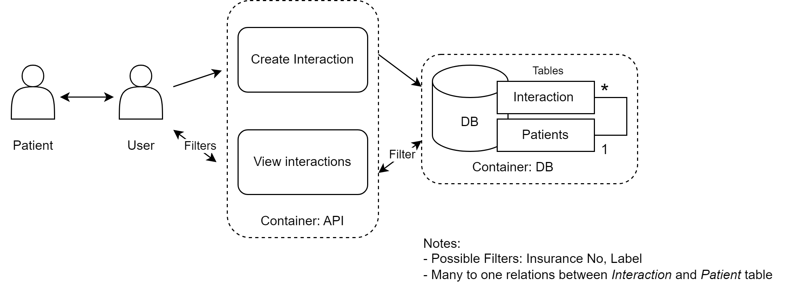

# doctor-patient-interactions-manager
This project implements a backend application designed to document patient interactions and view patient history. The application provides a comprehensive system for healthcare providers to record detailed patient interactions and access historical patient data efficiently.

## Details

- Every time during a patient’s visit, Doctors create `Interaction` objects that capture the essence of their conversations with the patients.
- At a high-level the `Interaction` object captures the following details (but not limited to!):
  - `insurance_no`: Unique identifier for the patient
  -  `id` : Unique identifier for the interactions of patient
  -  `ailment` : The patient's ailment.
  -  `symptoms` :The patient's symptoms.
  -  `interaction_date` : The date of interaction.
  -  `metrics` : Health metrics recorded during interaction.
  -  `remarks` : Additional remarks.
  -  `health_status` : Health status rating.
  -  `qa` : Q&A related to the interaction.
  -  `next_steps` :  Next steps in the treatment plan.
  -  `label` : Label for the interaction.
- The demo tool currently supports creation and retrieval of such interactions.
- The retrievals can be done based on patients’ unique id (such as insurance numbers). Additionally, doctors can filter interactions based on the `labels` tag.

# High level Design:



- Tech: FAST API, Dockers, Python’s SQL client for Database handling
- Microservice architecture with containers for API and Database

## Quick Start

**1. Build the Docker image:**

```bash

docker-compose up —build

```

**2. Accessing Services:**

After the containers are up and running:
- SQL Database: The SQL database can be accessed at localhost:3306. Adjust this based on the specific database system and port configured in your docker-compose.yml.
- API: The FastAPI-based API is accessible at localhost:8000. Users can interact with the API endpoints through this address.

**3. Explore API Documentation:**

Open your web browser and go to http://localhost:8000/docs to view the Swagger documentation.

**4. Load initial script to load datasets**

```bash

docker exec -it <container_id> bash

cd utils

python load_initial_data.py

```

**5. Run unittestcases**

```bash

pytest

```


## Next steps/ Future improvements

- As part of the database, I have incorporated a custom SQLBuilder framework. The reasoning behind this was the flexibility it would provide for custom data insertions and filtering in the columns. However, the complexity might increase with future features. Switching to a pure ORM model or a schema-less database such as MongoDB might be helpful.
- The `QA` field in the Interaction captures possible relevant questions asked by the doctor to the patients. With the advent of AI and LLMs, improving this feature by recommending relevant questions based on context using LLMs is envisioned. Also, it could provide povision to generate a summary report for respective patients.
- Analytics could be drawn from interaction objects to create a holistic profile for patients. Machine Learning techniques such as clustering similar patients might aid doctors during diagnosis.
- `@TODO` comments are included in the script where improvements are needed.
